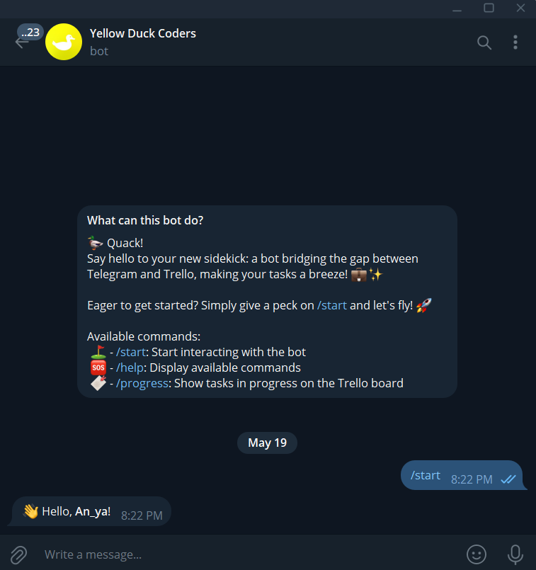

# YDC-TG_BOT

YDC-TG_BOT isn't your average Telegram bot—it's your all-in-one solution for user engagement, project management, and data organization.

With YDC-TG_BOT, seamlessly interact with users on Telegram while effortlessly managing your Trello board. It's as simple as that!

Utilizing webhooks, YDC-TG_BOT ensures real-time updates between your Telegram bot and Trello board, keeping everything in sync without missing a beat.

## Features
* Registers users in a database upon bot activation.
* Interacts with a Trello board.
* Automatically creates two columns, "InProgress" and "Done", on the Trello board upon program launch.
* Utilizes webhooks to notify when users interact with cards.

## Installation

1. Clone the repository:
```shell
https://github.com/Anna728560/YDC-TG_BOT.git
```

2. Navigate into the project directory:
```shell
cd YDC-TG_BOT
```

3. Set up a `virtual environment` and install the dependencies:
```shell
python -m venv venv
source venv/bin/activate # For linux/macos
venv\Scripts\activate # For windows
pip install -r bot_app/requirements.txt
```

4. Create a `.env` file in the root directory of the project and set up the necessary configuration variables. 
```python
# Get your own bot-token from the BotFather on Telegram 
BOT_TOKEN=your_bot_token
# Create a group where the bot will send messages about Trello updates and add your bot to this group
GROUP_CHAT_ID=your_tg_group_chat_id

# Set up database
DB_HOST=localhost
DB_PORT=port
DB_NAME="postgres"
DB_USER="postgres"
DB_PASSWORD=password

# Obtain your Trello API key and token. 
# You can get them from the Trello developer website: https://trello.com/app-key
TRELLO_API_KEY=your_trello_api_key
TRELLO_TOKEN=your_trello_token

# Set up a webhook URL for receiving Trello events. 
# You can create a webhook URL using services like ngrok (https://ngrok.com/) 
# or deploy your application to a server with a public URL.
WEBHOOK=webhook_url
```

## Usage
1. Run the script:
```shell
python main.py
```
2. Activate your bot on Telegram.



3. Upon program launch, a Trello board will be created automatically with two columns, `InProgress` and `Done`.


4. As users interact with the Trello cards, the bot will notify about the interactions.


## Tools and Technologies Used

* Programming language: `Python`
* Telegram bot: `aiogram`
* Database, db connection: `PostgreSQL`, `asyncpg`
* Environment variable management: `python-dotenv`
* HTTP requests: `aiohttp`
